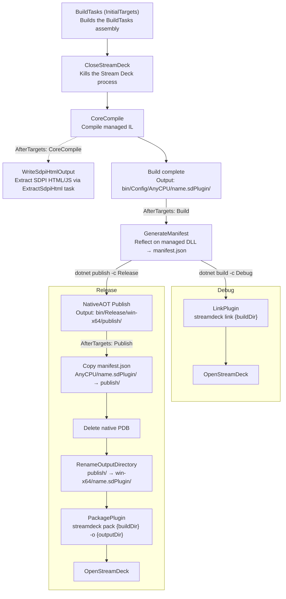

# Building your plugin

This toolkit comes with several MSBuild tasks to automate common (and annoying) tasks while building your plugin. The sample project csproj has a fully functional 
MSBuild pipeline that utilizes all of these tasks to automate as much tedium as possible. These work on both Windows and MacOS.

## Build Tasks

1. CloseStreamDeck: A before-`BeforeBuild` task that closes your open Stream Deck software.
2. GenerateManifest: An after-`Build` task that uses the manifest source generators to automatically build your plugin's `manifest.json`. 
See the [Manifest Generation](https://github.com/cmpnnt/streamdeck-toolkit/wiki/Manifest-Generation) page of the wiki for more details.
3. RenameOutputDirectory: An after-`Build` task to rename your build directory to the format the Stream Deck expects. By default in the 
example project, the directory uses the `<AssemblyName>` MSBuild property in lower case.
4. LinkPlugin: An after-`Build` task that uses the [Stream Deck CLI](https://docs.elgato.com/streamdeck/cli/intro/) to link your build 
directory (for both Debug and Release builds) to the Stream Deck plugin directory.
5. OpenStreamDeck: An after-`Build` task to reopen the Stream Deck software when the build is complete. When using JetBrains Rider, 
the build might occasionally fail with `error MSB3027: Could not copy...`. If this happens, run `./kill-msbuild.ps1` from the 
repository's root directory and rebuild. Running the `dotnet build` and `dotnet publish` commands directly shouldn't produce 
this error unless you first ran the build through Rider.
6. ExtractSdpiHtml: An after-`CoreCompile` task that works in conjunction with the `SdpiGenerator` source generator to create property 
inspector HTML and JavaScript files for your plugins. See the [SdpiGenerator documentation](https://github.com/cmpnnt/streamdeck-toolkit/wiki/Source-Generators#4-sdpigenerator) 
in the wiki for more details.

### Default Project Workflow

## Build Mode Notes

### Debug 

The build tasks will create a symbolic link to your debug built directory in the Stream Deck plugin directory. If the link already exists, you'll see a warning.

The plugin directories are:

MacOS: `~/Library/Application Support/Elgato/StreamDeck/Plugins/`
Windows: `%APPDATA%\Elgato\StreamDeck\Plugins\`

### Release

Behaves similarly to the Debug build, but with a few extra steps to handle the differences in the output of a Native AOT publish. 
The tasks will copy the generated `manifest.json` from the AnyCPU build output to the publish directory, delete the native PDB 
generated by Native AOT, and rename the publish output directory to match the expected format for Stream Deck plugins.

### Publish

Behaves identically to Release but packages the plugin using the Stream Deck CLI and places the resulting `.streamDeckPlugin` 
file in an `output` directory in your project root.

