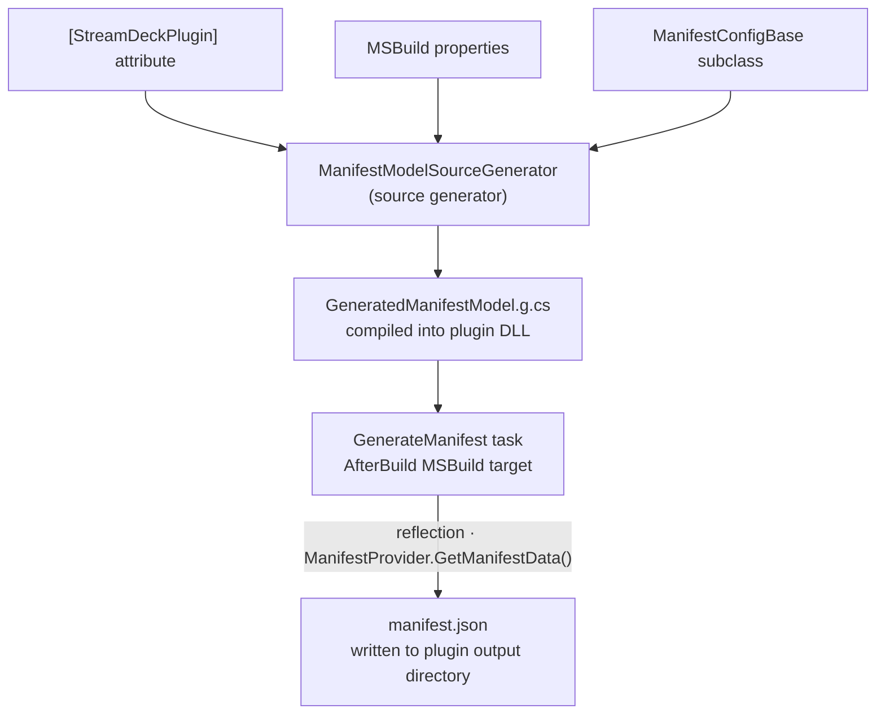

# Manifest Generation

The `ManifestModelSourceGenerator` automatically produces a valid `manifest.json` at build time. You never write or maintain the manifest file by hand — it is derived entirely from your C# code.

---

## Table of Contents

- [How it works](#how-it-works)
- [Priority order](#priority-order)
- [Setup](#setup)
- [Layer 1 — MSBuild properties](#layer-1--msbuild-properties)
- [Layer 2 — Attributes](#layer-2--attributes)
  - [`[StreamDeckPlugin]`](#streamdeckplugin)
  - [`[StreamDeckAction]`](#streamdeckaction)
- [Layer 3 — POCO config (ManifestConfigBase)](#layer-3--poco-config-manifestconfigbase)
  - [DefaultStates](#defaultstates)
  - [DefaultEncoder](#defaultencoder)
  - [ApplicationsToMonitor](#applicationstomonitor)
  - [Profiles](#profiles)
- [Automatically derived values](#automatically-derived-values)
- [Complete example](#complete-example)
- [Manifest property reference](#manifest-property-reference)

---

## How it works



The source generator runs during compilation and emits a `GeneratedManifest.ManifestProvider` class. After the build completes, the `GenerateManifest` MSBuild task loads the compiled plugin DLL, calls `ManifestProvider.GetManifestData()` using reflection, and serializes the result to `manifest.json`.

---

## Priority order

When multiple sources supply the same value, the highest-priority source wins:

```
ManifestConfigBase  >  [StreamDeckPlugin] / [StreamDeckAction]  >  MSBuild  >  Convention
     (POCO)                     (attributes)                       (props)      (derived)
```

Values derived automatically from code (UUIDs, Controllers) are never overridden.

---

## Setup

Add `CompilerVisibleProperty` items to your plugin `.csproj` so the generator can read MSBuild properties:

```xml
<ItemGroup>
  <CompilerVisibleProperty Include="AssemblyName" />
  <CompilerVisibleProperty Include="Version" />
  <CompilerVisibleProperty Include="Authors" />
  <CompilerVisibleProperty Include="Description" />
  <CompilerVisibleProperty Include="PackageProjectUrl" />
</ItemGroup>
```

No other setup is needed — the generator runs automatically because the `Cmpnnt.StreamDeckToolkit.SourceGenerators` project is already wired as an Analyzer reference.

---

## Layer 1 — MSBuild properties

These standard MSBuild/NuGet properties are read automatically. Set them in your `.csproj`:

```xml
<PropertyGroup>
  <Version>1.2.0</Version>
  <Authors>Your Name</Authors>
  <Description>A plugin that does something useful.</Description>
  <PackageProjectUrl>https://example.com/myplugin</PackageProjectUrl>
</PropertyGroup>
```

| MSBuild property | Manifest field | Default when not set |
|---|---|---|
| `Version` | `Version` | `"1.0.0"` |
| `Authors` | `Author` | Assembly name |
| `Description` | `Description` | `""` |
| `PackageProjectUrl` | `URL` | omitted |

---

## Layer 2 — Attributes

### `[StreamDeckPlugin]`

Apply once, either at assembly level (recommended) or on any class in the project.

**Assembly-level (recommended — place in `Program.cs` or a dedicated file):**

```csharp
[assembly: StreamDeckPlugin(
    Name = "My Plugin",
    UUID = "com.mycompany.myplugin",
    Category = "My Category",
    CategoryIcon = "Images/categoryIcon",
    Icon = "Images/pluginIcon",
    SDKVersion = 2,
    SoftwareMinVersion = SoftwareMinVersion.V6_5,
    WindowsMinVersion = "10",
    MacMinVersion = "12"
)]
```

**Class-level (alternative):**

```csharp
[StreamDeckPlugin(Name = "My Plugin", UUID = "com.mycompany.myplugin")]
class Program { ... }
```

#### All properties

| Property | Type | Description | Default |
|---|---|---|---|
| `Name` | `string` | Display name in Stream Deck | Assembly name |
| `UUID` | `string` | Plugin identifier in reverse-domain format | Lowercase assembly name |
| `Category` | `string` | Category label in the action list | omitted |
| `CategoryIcon` | `string` | Category icon path (no extension) | omitted |
| `Icon` | `string` | Plugin icon path (no extension) | `"Images/pluginIcon"` |
| `SDKVersion` | `int` | Stream Deck SDK version. Must be `2` or `3` | `2` |
| `SoftwareMinVersion` | `SoftwareMinVersion` | Minimum Stream Deck app version | `SoftwareMinVersion.V6_4` |
| `WindowsMinVersion` | `string` | Minimum Windows version (e.g. `"10"`) | omitted from OS list |
| `MacMinVersion` | `string` | Minimum macOS version (e.g. `"12"`) | omitted from OS list |
| `URL` | `string` | Plugin website URL (overrides MSBuild `PackageProjectUrl`) | from MSBuild |
| `SupportURL` | `string` | Support page URL | omitted |
| `PropertyInspectorPath` | `string` | Global default property inspector path | per-action convention |
| `CodePathWin` | `string` | Windows executable name override | `"{assemblyname}.exe"` |
| `CodePathMac` | `string` | macOS executable name override | `"{assemblyname}"` when `MacMinVersion` is set, otherwise omitted |

#### `SoftwareMinVersion` enum values

`V6_4` · `V6_5` · `V6_6` · `V6_7` · `V6_8` · `V6_9` · `V7_0` · `V7_1` · `V7_2` · `V7_3`

#### OS list behaviour

The `OS` array in the manifest is built from `WindowsMinVersion` and `MacMinVersion`. If neither is set, the generator defaults to Windows 10.

```csharp
// Windows only
[assembly: StreamDeckPlugin(WindowsMinVersion = "10")]
// → "OS": [{ "Platform": "windows", "MinimumVersion": "10" }]

// Both platforms
[assembly: StreamDeckPlugin(WindowsMinVersion = "10", MacMinVersion = "12")]
// → "OS": [{ "Platform": "windows", ... }, { "Platform": "mac", ... }]
```

---

### `[StreamDeckAction]`

Apply to each plugin action class. The generator reads it alongside the interface detection that derives `Controllers`.

```csharp
[StreamDeckAction(
    Name = "Record Clip",
    Tooltip = "Starts or stops clip recording",
    Icon = "Images/recordIcon",
    SupportedInMultiActions = true
)]
public partial class RecordAction : KeypadBase { ... }
```

#### All properties

| Property | Type | Description | Default |
|---|---|---|---|
| `Name` | `string` | Display name of the action in Stream Deck | Class name |
| `Tooltip` | `string` | Tooltip shown on hover in Stream Deck | omitted |
| `Icon` | `string` | Action icon path (no extension) | `"Images/pluginIcon"` |
| `PropertyInspectorPath` | `string` | Property inspector HTML path | `"PropertyInspector/{ClassName}.html"` |
| `SupportURL` | `string` | Action-specific support URL | omitted |
| `SupportedInMultiActions` | `bool` | Whether the action can be used in multi-actions | omitted (SD assumes `true`) |
| `SupportedInKeyLogicActions` | `bool` | Whether the action can be used in key logic actions | omitted (SD assumes `true`) |
| `DisableAutomaticStates` | `bool` | Disables automatic state management | omitted (SD assumes `false`) |
| `DisableCaching` | `bool` | Disables image caching for this action | omitted (SD assumes `false`) |
| `UserTitleEnabled` | `bool` | Whether the user can set a custom title | omitted (SD assumes `true`) |
| `VisibleInActionsList` | `bool` | Whether the action appears in the action list | omitted (SD assumes `true`) |

Boolean properties are **only written to the manifest when explicitly set** — omitted fields let Stream Deck apply its own defaults (shown above).

#### PropertyInspectorPath convention

If you use `[SdpiOutputDirectory("PropertyInspector/")]` on an action class, the SDPI generator writes `PropertyInspector/{ClassName}.html`. The manifest generator uses the same convention by default, so the two are automatically consistent without any explicit path configuration.

---

## Layer 3 — POCO config (`ManifestConfigBase`)

For values that cannot be expressed as attribute arguments — complex nested objects like `States`, `Encoder`, and arrays — subclass `ManifestConfigBase` anywhere in your plugin project. The generator finds the subclass automatically (no attribute needed) and instantiates it at build time using the `GenerateManifest` task.

```csharp
using Cmpnnt.StreamDeckToolkit.Manifest;

internal class MyManifestConfig : ManifestConfigBase
{
    // Override only what you need — all properties default to null (omitted)
}
```

> **One subclass only.** If multiple non-abstract `ManifestConfigBase` subclasses exist in the project, the generator uses the first one it finds. Use one class.

---

### DefaultStates

Sets the `States` array for every action that doesn't otherwise define its own. When `null`, the generator writes a single state with `Image = "Images/pluginAction"`.

```csharp
public override ManifestStateConfig[] DefaultStates =>
[
    new ManifestStateConfig
    {
        Image = "Images/pluginAction",
        TitleAlignment = "middle",
        FontSize = 14,
    }
];
```

Multiple states (for toggle actions):

```csharp
public override ManifestStateConfig[] DefaultStates =>
[
    new ManifestStateConfig { Image = "Images/off",  Title = "Off" },
    new ManifestStateConfig { Image = "Images/on",   Title = "On"  },
];
```

#### `ManifestStateConfig` properties

| Property | Type | Manifest field |
|---|---|---|
| `Image` | `string` | `Image` (required) |
| `Title` | `string?` | `Title` |
| `Name` | `string?` | `Name` |
| `ShowTitle` | `bool?` | `ShowTitle` |
| `TitleAlignment` | `string?` | `TitleAlignment` — `"top"`, `"middle"`, `"bottom"` |
| `TitleColor` | `string?` | `TitleColor` |
| `FontFamily` | `string?` | `FontFamily` |
| `FontSize` | `int?` | `FontSize` |
| `FontStyle` | `string?` | `FontStyle` — `""`, `"Bold"`, `"Italic"`, `"Bold Italic"`, `"Regular"` |
| `FontUnderline` | `bool?` | `FontUnderline` |
| `MultiActionImage` | `string?` | `MultiActionImage` |

---

### DefaultEncoder

Sets the `Encoder` object for every action that implements `IEncoderPlugin`. When `null`, the `Encoder` field is omitted from those actions.

```csharp
public override ManifestEncoderConfig DefaultEncoder => new()
{
    Layout = "$B1",
    TriggerDescription = new ManifestTriggerDescription
    {
        Push    = "Play / Pause",
        Rotate  = "Adjust Volume",
        Touch   = "Play / Pause",
        LongTouch = "Skip Track",
    }
};
```

#### `ManifestEncoderConfig` properties

| Property | Type | Manifest field |
|---|---|---|
| `Layout` | `string?` | `layout` — one of `"$A0"`, `"$A1"`, `"$B1"`, `"$B2"`, `"$C1"`, `"$X1"`, or a custom `.json` path |
| `Background` | `string?` | `background` |
| `Icon` | `string?` | `Icon` |
| `StackColor` | `string?` | `StackColor` |
| `TriggerDescription` | `ManifestTriggerDescription?` | `TriggerDescription` |

#### `ManifestTriggerDescription` properties

| Property | Type | Manifest field |
|---|---|---|
| `Push` | `string?` | `Push` |
| `Rotate` | `string?` | `Rotate` |
| `Touch` | `string?` | `Touch` |
| `LongTouch` | `string?` | `LongTouch` |

---

### ApplicationsToMonitor

Tells Stream Deck to notify the plugin when specific applications launch or quit. When `null`, the field is omitted.

```csharp
public override ManifestApplicationsToMonitor ApplicationsToMonitor => new()
{
    Windows = ["notepad.exe", "calc.exe"],
    Mac     = ["com.apple.Notes"],
};
```

#### `ManifestApplicationsToMonitor` properties

| Property | Type | Manifest field |
|---|---|---|
| `Windows` | `string[]?` | `windows` — process names (e.g. `"notepad.exe"`) |
| `Mac` | `string[]?` | `mac` — bundle identifiers (e.g. `"com.apple.Notes"`) |

---

### Profiles

Bundles Stream Deck profiles to install with the plugin. When `null`, the field is omitted.

```csharp
public override ManifestProfile[] Profiles =>
[
    new ManifestProfile
    {
        Name       = "My Profile",
        DeviceType = 0,        // 0 = Stream Deck
        AutoInstall = true,
    }
];
```

#### `ManifestProfile` properties

| Property | Type | Manifest field |
|---|---|---|
| `Name` | `string` | `Name` (required) |
| `DeviceType` | `int` | `DeviceType` (required) — see Elgato docs for device type IDs |
| `AutoInstall` | `bool?` | `AutoInstall` |
| `DontAutoSwitchWhenInstalled` | `bool?` | `DontAutoSwitchWhenInstalled` |
| `Readonly` | `bool?` | `Readonly` |

---

## Automatically derived values

These are computed from the code and cannot be overridden:

| Manifest field | Source | Example |
|---|---|---|
| Action `UUID` | Lowercase fully-qualified class name | `"com.mycompany.myplugin.recordaction"` |
| Plugin `UUID` | `[StreamDeckPlugin(UUID = ...)]` or lowercase assembly name | `"com.mycompany.myplugin"` |
| `CodePath` | Mac-only: `"{assemblyname}"` (or `CodePathMac`); otherwise `"{assemblyname}.exe"` (or `CodePathWin`) | `"com.mycompany.myplugin.exe"` |
| `Controllers` | Interfaces implemented by the action class | `["Keypad"]`, `["Encoder"]`, or `["Keypad", "Encoder"]` |
| Action `PropertyInspectorPath` | `"PropertyInspector/{ClassName}.html"` or attribute override | `"PropertyInspector/RecordAction.html"` |

**Interface → Controllers mapping:**

| Interface | `Controllers` entry |
|---|---|
| `IKeypadPlugin` | `"Keypad"` |
| `IEncoderPlugin` | `"Encoder"` |
| Both | `["Keypad", "Encoder"]` |

Base classes (`KeypadBase`, `EncoderBase`, `KeyAndEncoderBase`) implement the corresponding interfaces, so the detection works automatically.

---

## Complete example

### `.csproj`

```xml
<PropertyGroup>
  <Version>1.0.0</Version>
  <Authors>ACME Corp</Authors>
  <Description>Controls a widget with the Stream Deck.</Description>
  <PackageProjectUrl>https://acme.example/widget-plugin</PackageProjectUrl>
</PropertyGroup>

<ItemGroup>
  <CompilerVisibleProperty Include="AssemblyName" />
  <CompilerVisibleProperty Include="Version" />
  <CompilerVisibleProperty Include="Authors" />
  <CompilerVisibleProperty Include="Description" />
  <CompilerVisibleProperty Include="PackageProjectUrl" />
</ItemGroup>
```

### `Program.cs`

```csharp
using Cmpnnt.StreamDeckToolkit.Attributes;
using Cmpnnt.StreamDeckToolkit.Runtime;
using Cmpnnt.StreamDeckToolkit.SourceGenerators;

[assembly: StreamDeckPlugin(
    Name = "Widget Controller",
    UUID = "com.acme.widgetcontroller",
    Category = "ACME",
    CategoryIcon = "Images/categoryIcon",
    Icon = "Images/pluginIcon",
    SDKVersion = 2,
    SoftwareMinVersion = SoftwareMinVersion.V6_5,
    WindowsMinVersion = "10"
)]

class Program
{
    static void Main(string[] args) => SdWrapper.Run(args, new PluginActionIdRegistry());
}
```

### `WidgetAction.cs`

```csharp
using Cmpnnt.StreamDeckToolkit.Actions;
using Cmpnnt.StreamDeckToolkit.Attributes;
using Cmpnnt.StreamDeckToolkit.Runtime;

[SdpiOutputDirectory("PropertyInspector/")]
[StreamDeckAction(
    Name = "Toggle Widget",
    Tooltip = "Toggles the widget on or off",
    Icon = "Images/widgetAction",
    SupportedInMultiActions = true
)]
public partial class WidgetAction : KeypadBase
{
    public WidgetAction(IOutboundConnection connection, InitialPayload payload)
        : base(connection, payload) { }

    // ... event handlers
}
```

### `WidgetEncoderAction.cs`

```csharp
using Cmpnnt.StreamDeckToolkit.Actions;
using Cmpnnt.StreamDeckToolkit.Attributes;
using Cmpnnt.StreamDeckToolkit.Runtime;

[StreamDeckAction(
    Name = "Adjust Widget",
    Tooltip = "Rotate to adjust widget level",
    Icon = "Images/widgetAction"
)]
public class WidgetEncoderAction : EncoderBase
{
    public WidgetEncoderAction(IOutboundConnection connection, InitialPayload payload)
        : base(connection, payload) { }

    // ... event handlers
}
```

### `PluginManifestConfig.cs`

```csharp
using Cmpnnt.StreamDeckToolkit.Manifest;

internal class PluginManifestConfig : ManifestConfigBase
{
    public override ManifestStateConfig[] DefaultStates =>
    [
        new ManifestStateConfig
        {
            Image          = "Images/widgetAction",
            TitleAlignment = "middle",
            FontSize       = 12,
        }
    ];

    public override ManifestEncoderConfig DefaultEncoder => new()
    {
        Layout = "$B1",
        TriggerDescription = new ManifestTriggerDescription
        {
            Rotate = "Adjust Level",
            Push   = "Reset",
        }
    };

    public override ManifestApplicationsToMonitor ApplicationsToMonitor => new()
    {
        Windows = ["widget.exe"]
    };
}
```

### Resulting `manifest.json`

```json
{
  "$schema": "https://schemas.elgato.com/streamdeck/plugins/manifest.json",
  "Actions": [
    {
      "Controllers": ["Keypad"],
      "Icon": "Images/widgetAction",
      "Name": "Toggle Widget",
      "PropertyInspectorPath": "PropertyInspector/WidgetAction.html",
      "States": [
        { "FontSize": 12, "Image": "Images/widgetAction", "TitleAlignment": "middle" }
      ],
      "SupportedInMultiActions": true,
      "Tooltip": "Toggles the widget on or off",
      "UUID": "com.acme.widgetcontroller.widgetaction"
    },
    {
      "Controllers": ["Encoder"],
      "Encoder": {
        "layout": "$B1",
        "TriggerDescription": { "Push": "Reset", "Rotate": "Adjust Level" }
      },
      "Icon": "Images/widgetAction",
      "Name": "Adjust Widget",
      "PropertyInspectorPath": "PropertyInspector/WidgetEncoderAction.html",
      "States": [
        { "FontSize": 12, "Image": "Images/widgetAction", "TitleAlignment": "middle" }
      ],
      "Tooltip": "Rotate to adjust widget level",
      "UUID": "com.acme.widgetcontroller.widgetencoderAction"
    }
  ],
  "ApplicationsToMonitor": { "windows": ["widget.exe"] },
  "Author": "ACME Corp",
  "Category": "ACME",
  "CategoryIcon": "Images/categoryIcon",
  "CodePath": "com.acme.widgetcontroller.exe",
  "Description": "Controls a widget with the Stream Deck.",
  "Icon": "Images/pluginIcon",
  "Name": "Widget Controller",
  "OS": [{ "Platform": "windows", "MinimumVersion": "10" }],
  "SDKVersion": 2,
  "Software": { "MinimumVersion": "6.5" },
  "URL": "https://acme.example/widget-plugin",
  "UUID": "com.acme.widgetcontroller",
  "Version": "1.0.0"
}
```

---

## Manifest property reference

Quick reference for which source controls each manifest field.

| Manifest field | Source |
|---|---|
| `$schema` | Fixed constant |
| `Actions[].UUID` | Derived: lowercase FQN of the action class |
| `Actions[].Name` | `[StreamDeckAction(Name)]` → class name |
| `Actions[].Icon` | `[StreamDeckAction(Icon)]` → `"Images/pluginIcon"` |
| `Actions[].Tooltip` | `[StreamDeckAction(Tooltip)]` |
| `Actions[].Controllers` | Derived: interfaces implemented by the class |
| `Actions[].PropertyInspectorPath` | `[StreamDeckAction(PropertyInspectorPath)]` → `[StreamDeckPlugin(PropertyInspectorPath)]` → `"PropertyInspector/{ClassName}.html"` |
| `Actions[].States` | `ManifestConfigBase.DefaultStates` → single default state |
| `Actions[].Encoder` | `ManifestConfigBase.DefaultEncoder` (only for encoder actions) |
| `Actions[].SupportedInMultiActions` | `[StreamDeckAction(SupportedInMultiActions)]` — omitted when not set |
| `Actions[].SupportedInKeyLogicActions` | `[StreamDeckAction(SupportedInKeyLogicActions)]` — omitted when not set |
| `Actions[].DisableAutomaticStates` | `[StreamDeckAction(DisableAutomaticStates)]` — omitted when not set |
| `Actions[].DisableCaching` | `[StreamDeckAction(DisableCaching)]` — omitted when not set |
| `Actions[].UserTitleEnabled` | `[StreamDeckAction(UserTitleEnabled)]` — omitted when not set |
| `Actions[].VisibleInActionsList` | `[StreamDeckAction(VisibleInActionsList)]` — omitted when not set |
| `Actions[].SupportURL` | `[StreamDeckAction(SupportURL)]` |
| `ApplicationsToMonitor` | `ManifestConfigBase.ApplicationsToMonitor` |
| `Author` | MSBuild `Authors` → assembly name |
| `Category` | `[StreamDeckPlugin(Category)]` |
| `CategoryIcon` | `[StreamDeckPlugin(CategoryIcon)]` |
| `CodePath` | Mac-only: `[StreamDeckPlugin(CodePathMac)]` → `"{assemblyname}"`; otherwise: `[StreamDeckPlugin(CodePathWin)]` → `"{assemblyname}.exe"` |
| `CodePathMac` | `[StreamDeckPlugin(CodePathMac)]` → `"{assemblyname}"` when both platforms configured; omitted for Mac-only |
| `Description` | MSBuild `Description` |
| `Icon` | `[StreamDeckPlugin(Icon)]` → `"Images/pluginIcon"` |
| `Name` | `[StreamDeckPlugin(Name)]` → MSBuild `AssemblyName` |
| `OS` | Built from `[StreamDeckPlugin(WindowsMinVersion, MacMinVersion)]` → Windows 10 default |
| `Profiles` | `ManifestConfigBase.Profiles` |
| `PropertyInspectorPath` | `[StreamDeckPlugin(PropertyInspectorPath)]` (global default) |
| `SDKVersion` | `[StreamDeckPlugin(SDKVersion)]` → `2` |
| `Software.MinimumVersion` | `[StreamDeckPlugin(SoftwareMinVersion)]` → `"6.4"` |
| `SupportURL` | `[StreamDeckPlugin(SupportURL)]` |
| `URL` | `[StreamDeckPlugin(URL)]` → MSBuild `PackageProjectUrl` |
| `UUID` | `[StreamDeckPlugin(UUID)]` → lowercase assembly name |
| `Version` | MSBuild `Version` → `"1.0.0"` |
