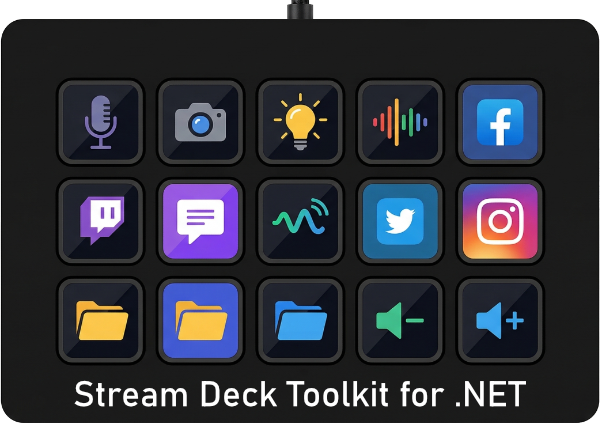

# Stream Deck Toolkit for .NET

> A C# library that manages communication with the Stream Deck, allowing you to focus on actually writing your plugin's logic.

## ⚠️ WIP ⚠️

This toolkit is still a work in progress. It is useable and is currently feature complete for my needs,
but there might still be some bugs or rough edges. If you encounter any issues or want to request a feature,
please head to the [Discussions](https://github.com/cmpnnt/streamdeck-tools/discussions) section.

Expect breaking changes soon, especially around naming. I intend to move away from the "streamdeck" and "sd" naming conventions.

  

## Getting Started

There is currently no NuGet package, so you'll have to clone the repository. I suggest starting with the 
[sample plugin](https://github.com/cmpnnt/streamdeck-toolkit/tree/main/Dev.Cmpnnt.SamplePlugin) as your base.

- Take a look at the [wiki](https://github.com/cmpnnt/streamdeck-toolkit/wiki) for usage instructions and examples.
- Full API documentation can be found [here](https://cmpnnt.github.io/streamdeck-toolkit/api/index.html), if you're into that sort of thing.

## Discussion and Support
**Discussions:** [Start here](https://github.com/cmpnnt/streamdeck-tools/discussions) for support and general questions about the toolkit.
Questions about plugins that use this toolkit should first be directed toward their developers.

## Toolkit Features
- Encapsulates all the communication with the Stream Deck. Writing a plugin requires only implementing one of three base classes.
- Cross-platform.
- Native AOT thanks to source generators and System.Text.Json
- Automatic manifest generation sourced from your plugin, MSBuild properties and a few attributes.
- Automatic plugin action registration.
- MSBuild tasks to automatically stop and restart the Stream Deck software at build time.
- MSBuild task to package your plugin when you build in Release mode.
- Comprehensive sample plugin.
- Auto-populated user settings when modified in the Property Inspector.
- Access the Global Settings from anywhere in your code.
- Simplified working with filenames from the Stream Deck SDK.
- Large set of helper functions to simplify creating images and sending them to the Stream Deck.
- NLog for logging. 

## Known issues
- Jetbrains Rider might occasionally hold onto the MSBuild tasks and prevent the solution from building. If this happens, use
[kill-msbuild.ps1](kill-msbuild.ps1) and try rebuilding.
- Update to latest Stream Deck SDK and add new devices.
- Complete incompatibility with BarRaider's streamdeck-tools, on which this is based.

## TODO:

- Add more tests.
- More functional (manual) testing.