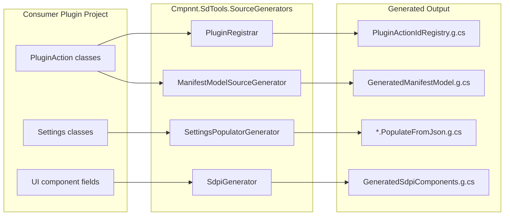
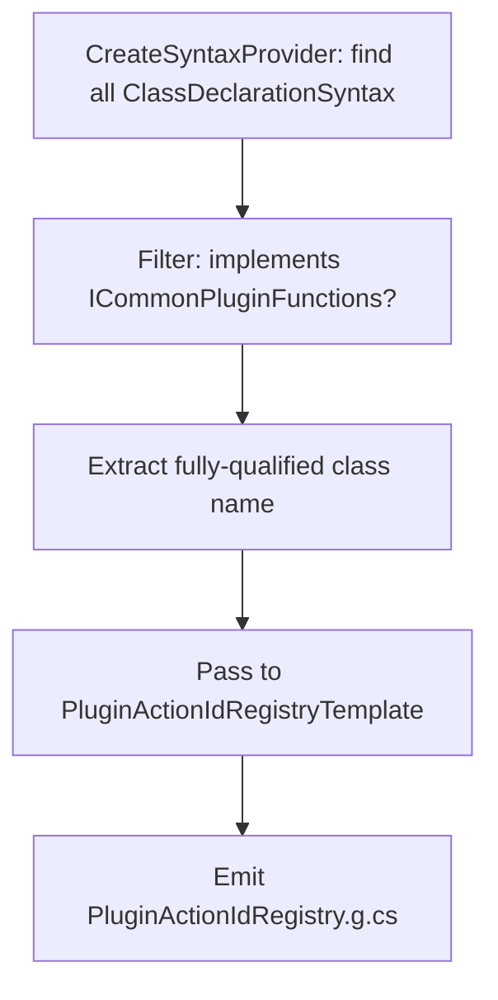
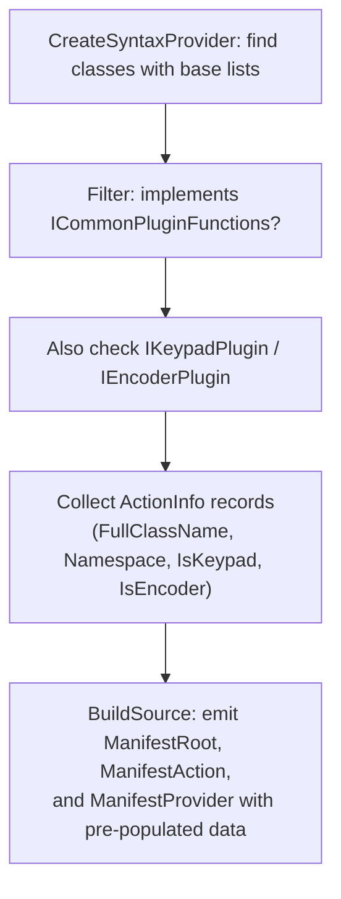
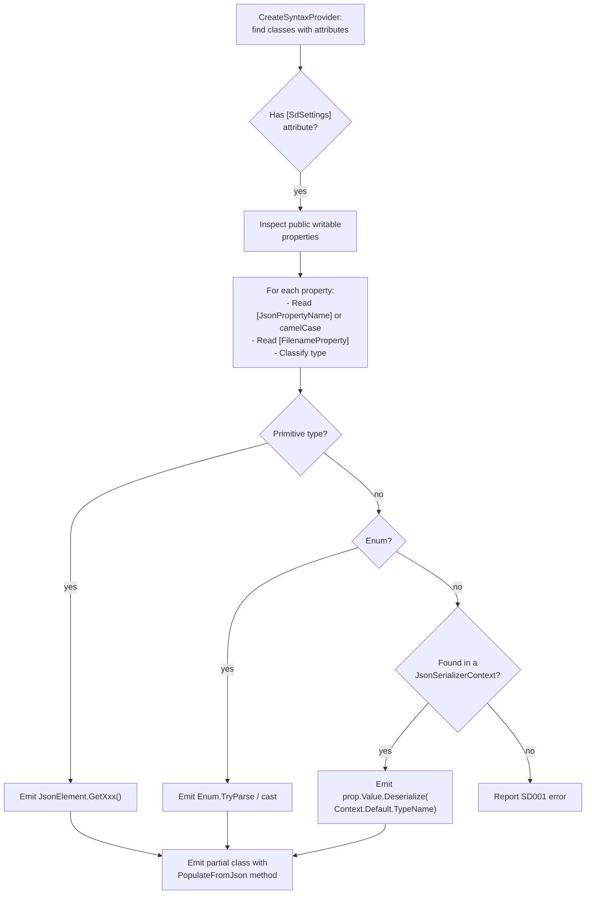
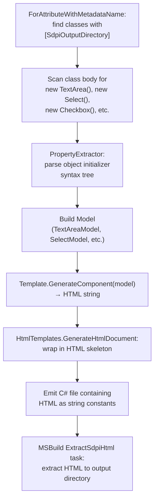
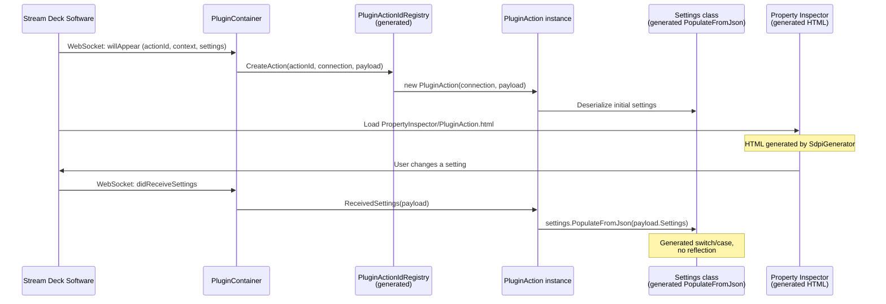

# Source Generators in streamdeck-tools

## Table of Contents

- [Overview](#overview)
  - [Project wiring](#project-wiring)
- [1. PluginRegistrar](#1-pluginregistrar)
  - [Problem](#problem)
  - [How it works](#how-it-works)
  - [Generated output (sample)](#generated-output-sample)
  - [Consumer usage](#consumer-usage)
- [2. ManifestModelSourceGenerator](#2-manifestmodelsourcegenerator)
  - [Problem](#problem-1)
  - [How it works](#how-it-works-1)
  - [Generated output (sample)](#generated-output-sample-1)
  - [Status](#status)
- [3. SettingsPopulatorGenerator](#3-settingspopulatorgenerator)
  - [Problem](#problem-2)
  - [How it works](#how-it-works-2)
  - [Type handling table](#type-handling-table)
  - [Generated output (sample)](#generated-output-sample-2)
  - [Consumer usage](#consumer-usage-1)
  - [Diagnostics](#diagnostics)
- [4. SdpiGenerator](#4-sdpigenerator)
  - [Problem](#problem-3)
  - [How it works](#how-it-works-3)
  - [Supported components](#supported-components)
  - [Consumer usage](#consumer-usage-2)
- [How the generators interact at runtime](#how-the-generators-interact-at-runtime)
- [Adding a new generator](#adding-a-new-generator)
  - [Key dependencies available in the generator project](#key-dependencies-available-in-the-generator-project)

---

This document describes the four Roslyn source generators in the `Cmpnnt.SdTools.SourceGenerators` project: what problems they solve, how they work internally, and how consumer plugin projects use them.

## Overview

All four generators live in `Cmpnnt.SdTools.SourceGenerators/` and are wired into consumer projects as Roslyn analyzers (not regular project references). This means they run inside the compiler during build and emit `.g.cs` files that participate in compilation.



### Project wiring

Consumer projects reference the generator assembly as an analyzer, not a compile-time dependency:

```xml
<!-- Dev.Cmpnnt.SamplePlugin.csproj -->
<ProjectReference Include="..\Cmpnnt.SdTools.SourceGenerators\Cmpnnt.SdTools.SourceGenerators.csproj"
                  ReferenceOutputAssembly="false"
                  OutputItemType="Analyzer" />
```

To inspect generated output on disk, the consumer enables `EmitCompilerGeneratedFiles`:

```xml
<EmitCompilerGeneratedFiles>true</EmitCompilerGeneratedFiles>
<CompilerGeneratedFilesOutputPath>$(BaseIntermediateOutputPath)Generated</CompilerGeneratedFilesOutputPath>
```

Generated files appear under:
```
obj/Generated/Cmpnnt.SdTools.SourceGenerators/
    Cmpnnt.SdTools.SourceGenerators.PluginRegistrar/
    Cmpnnt.SdTools.SourceGenerators.ManifestModelSourceGenerator/
    Cmpnnt.SdTools.SourceGenerators.SettingsPopulatorGenerator/
    Cmpnnt.SdTools.SourceGenerators.Sdpi.SdpiGenerator/
```

---

## 1. PluginRegistrar

- **File:** `ActionRegistrar.cs`
- **Template:** `Templates/PluginActionIdRegistryTemplate.cs`
- **Generated file:** `PluginActionIdRegistry.g.cs`

### Problem

The Stream Deck runtime routes events to plugin actions by string action ID (e.g. `"cmpnnt.sdtools.sampleplugin.pluginaction"`). The host needs a factory that maps these IDs to concrete class constructors. Without code generation, this requires `Activator.CreateInstance` or a hand-maintained switch statement — both are either AOT-hostile or error-prone.

### How it works



1. The generator scans every class declaration in the compilation.
2. For each non-abstract class implementing `Cmpnnt.SdTools.Backend.ICommonPluginFunctions`, it collects the fully-qualified class name.
3. The template emits a `PluginActionIdRegistry` class implementing `IPluginActionRegistry` with:
   - A `FrozenSet<string>` of all action IDs (lowercase fully-qualified class names)
   - A `FrozenDictionary<string, Func<ISdConnection, InitialPayload, ICommonPluginFunctions>>` mapping each ID to a `new ClassName(conn, payload)` factory lambda

### Generated output (sample)

```csharp
// PluginActionIdRegistry.g.cs (abridged)
public class PluginActionIdRegistry : IPluginActionRegistry
{
    private static readonly FrozenDictionary<string, Func<ISdConnection, InitialPayload, ICommonPluginFunctions>>
        _actionFactories = CreateFactories();
    private static readonly FrozenSet<string> _actionIds = CreateActionIdSet();

    public ICommonPluginFunctions CreateAction(string actionId, ISdConnection connection, InitialPayload payload)
    {
        if (_actionFactories.TryGetValue(actionId, out var factory))
            return factory(connection, payload);
        return null;
    }

    private static FrozenDictionary<...> CreateFactories()
    {
        var factories = new Dictionary<...>()
        {
            ["cmpnnt.sdtools.sampleplugin.pluginaction"]  = (conn, load) => new PluginAction(conn, load),
            ["cmpnnt.sdtools.sampleplugin.pluginaction2"] = (conn, load) => new PluginAction2(conn, load),
            ["cmpnnt.sdtools.sampleplugin.pluginaction3"] = (conn, load) => new PluginAction3(conn, load),
        };
        return factories.ToFrozenDictionary();
    }
}
```

### Consumer usage

The generated registry is passed into the SDK entry point in `Program.cs`:

```csharp
// Program.cs
SdWrapper.Run(args, new PluginActionIdRegistry());
```

`PluginContainer` then calls `registry.CreateAction(actionId, connection, payload)` each time the Stream Deck software instantiates a new action tile.

---

## 2. ManifestModelSourceGenerator

- **File:** `ManifestGenerator.cs`
- **Generated file:** `GeneratedManifestModel.g.cs`

### Problem

Stream Deck plugins require a `manifest.json` describing the plugin's actions, their capabilities (Keypad, Encoder), and metadata. Keeping this JSON file in sync with the actual C# action classes is tedious and error-prone.

### How it works



1. Finds all concrete (non-abstract) classes implementing `ICommonPluginFunctions`.
2. For each, checks whether it also implements `IKeypadPlugin` and/or `IEncoderPlugin` — these determine the `Controllers` array in the manifest.
3. Emits a `GeneratedManifest` namespace containing:
   - Data-model classes (`ManifestRoot`, `ManifestAction`, `OsInfo`, `SoftwareInfo`, `EncoderInfo`, `StateInfo`, etc.) with `[JsonPropertyName]` attributes matching the Elgato manifest schema.
   - A `ManifestProvider` static class that pre-populates a `ManifestRoot` object with the discovered actions.

### Generated output (sample)

```csharp
// GeneratedManifestModel.g.cs (abridged)
internal static class ManifestProvider
{
    public static ManifestRoot GetManifestData() => _manifestData;

    private static ManifestRoot CreateManifestData()
    {
        var root = new ManifestRoot();
        root.Uuid = "cmpnnt.sdtools.sampleplugin";
        root.CodePath = "cmpnnt.sdtools.sampleplugin.exe";

        {
            var action = new ManifestAction();
            action.Uuid = "cmpnnt.sdtools.sampleplugin.pluginaction";
            action.PropertyInspectorPath = "PropertyInspector/PluginAction.html";
            action.Controllers = new List<string> { "Keypad", "Encoder" };
            action.Name = "PluginAction";
            root.Actions.Add(action);
        }
        // ... one block per action class
        return root;
    }
}
```

### Status

This generator is partially implemented. The TODO comments at the bottom of `ManifestGenerator.cs` list remaining work: pulling Version/Author/Description from MSBuild properties, generating OS info from the runtime, sourcing icons, and populating Encoder/States from attributes.

---

## 3. SettingsPopulatorGenerator

- **File:** `SettingsPopulatorGenerator.cs`
- **Generated files:** `{ClassName}.PopulateFromJson.g.cs` (one per settings class)

### Problem

Plugin actions have settings classes whose values arrive from the Stream Deck software as `JsonElement` payloads. These payloads may contain only the properties that changed — a JSON **merge/patch**, not a full replacement. The previous solution, `Tools.AutoPopulateSettings<T>`, used reflection (`PropertyInfo`, `GetCustomAttributes`, `SetValue`) and `JsonSerializer.Deserialize(element, runtimeType)` — all incompatible with native AOT.

### How it works



1. Finds classes decorated with `[SdSettings]` (`Cmpnnt.SdTools.Attributes.SdSettingsAttribute`).
2. For each class, collects its public settable properties and determines:
   - **JSON key**: from `[JsonPropertyName("...")]` if present, otherwise `JsonNamingPolicy.CamelCase.ConvertName(PropertyName)`.
   - **Is filename**: whether `[FilenameProperty]` is applied (triggers `C:\fakepath\` stripping).
   - **Type classification**: one of 20+ categories (String, Bool, NullableBool, Int, NullableInt, ..., Enum, NullableEnum, Complex, Unknown).
3. For complex types, the generator scans the compilation for `JsonSerializerContext` subclasses with `[JsonSerializable(typeof(T))]` attributes, building a lookup from type to context expression (e.g. `SamplePluginSerializerContext.Default.PluginAction2Settings`).
4. Emits a `partial class` implementing `ISettingsPopulatable` with a `PopulateFromJson(JsonElement)` method. The method iterates the JSON properties and dispatches via a `switch (prop.Name)` — no reflection, no runtime Type lookups.

### Type handling table

| Type | Generated accessor | JSON ValueKind check |
|------|-------------------|---------------------|
| `string` | `GetString()` | `String \|\| Null` |
| `bool` | `GetBoolean()` | `True \|\| False` |
| `int` | `GetInt32()` | `Number` |
| `long` | `GetInt64()` | `Number` |
| `float` | `GetSingle()` | `Number` |
| `double` | `GetDouble()` | `Number` |
| `decimal` | `GetDecimal()` | `Number` |
| `Guid` | `GetGuid()` | `String` |
| `DateTime` | `GetDateTime()` | `String` |
| Nullable&lt;T&gt; | Same as T + null branch | `Null` or T's kind |
| Enum | `Enum.TryParse` / `(T)GetInt32()` | `String` or `Number` |
| Complex | `Deserialize(Context.Default.T)` | any |
| `[FilenameProperty]` | `GetString()` + fakepath strip | `String` |

### Generated output (sample)

For `PluginAction2Settings` with `[FilenameProperty] string OutputFileName` and `string InputString`:

```csharp
// PluginAction2Settings.PopulateFromJson.g.cs
internal partial class PluginAction2Settings : ISettingsPopulatable
{
    public int PopulateFromJson(JsonElement element)
    {
        if (element.ValueKind != JsonValueKind.Object) return 0;

        int count = 0;
        foreach (JsonProperty prop in element.EnumerateObject())
        {
            switch (prop.Name)
            {
                case "outputFileName":
                    if (prop.Value.ValueKind == JsonValueKind.String)
                    {
                        string _raw = prop.Value.GetString();
                        if (_raw != null)
                        {
                            OutputFileName = _raw == "No file..."
                                ? string.Empty
                                : Uri.UnescapeDataString(_raw.Replace("C:\\fakepath\\", ""));
                            count++;
                        }
                    }
                    break;
                case "inputString":
                    if (prop.Value.ValueKind == JsonValueKind.String || ...)
                    {
                        InputString = prop.Value.GetString();
                        count++;
                    }
                    break;
            }
        }
        return count;
    }
}
```

### Consumer usage

Settings classes must be `partial` and decorated with `[SdSettings]`:

```csharp
[SdSettings]
internal partial class PluginAction2Settings
{
    [FilenameProperty]
    [JsonPropertyName("outputFileName")]
    public string OutputFileName { get; set; }

    [JsonPropertyName("inputString")]
    public string InputString { get; set; }
}
```

Plugin actions call `PopulateFromJson` when new settings arrive from the property inspector:

```csharp
public override void ReceivedSettings(ReceivedSettingsPayload payload)
{
    settings.PopulateFromJson(payload.Settings);
    SaveSettings();
}
```

### Diagnostics

| ID | Severity | Description |
|----|----------|-------------|
| SD001 | Error | A property has a complex type that isn't registered in any `JsonSerializerContext`. Fix: add `[JsonSerializable(typeof(YourType))]` to your context class. |

---

## 4. SdpiGenerator

- **File:** `Sdpi/SdpiGenerator.cs`
- **Models:** `Sdpi/Models/` (one per component type)
- **Templates:** `Sdpi/Templates/` (one per component type)
- **Helpers:** `Sdpi/Utils/PropertyExtractor.cs`, `StringUtils.cs`
- **Generated file:** `GeneratedSdpiComponents.g.cs`

### Problem

Each Stream Deck plugin action needs a Property Inspector — an HTML page displayed in the Stream Deck software when the user configures an action. Writing and maintaining these HTML pages by hand, especially keeping them in sync with the plugin's settings, is error-prone. The SDPI (Stream Deck Property Inspector) component library provides web components (`<sdpi-textarea>`, `<sdpi-select>`, etc.) but the HTML boilerplate is still manual.

### How it works



The SDPI generator has the most complex pipeline of the four generators because it bridges C# code to HTML output via a build task:

1. **Discovery**: Uses `ForAttributeWithMetadataName` to find classes decorated with `[SdpiOutputDirectory("PropertyInspector/")]`.

2. **Component extraction**: Walks the class syntax tree looking for `BaseObjectCreationExpressionSyntax` nodes. For each, resolves the type symbol and checks if it's a known SDPI component (`Cmpnnt.SdTools.Components.TextArea`, `.Select`, `.Checkbox`, etc.).

3. **Property extraction** (`PropertyExtractor`): Parses the object initializer to extract property values at compile time. Handles string literals, integer constants, boolean values, nested objects (e.g. `DataSourceSettings`), and collection expressions (e.g. option lists).

4. **Model population**: Each component type has a model class (e.g. `TextAreaModel` with `Label`, `Setting`, `Rows`, `MaxLength`, `ShowLength`, etc.). The generator populates the model from the extracted property dictionary.

5. **HTML generation**: Each component type has a template (e.g. `TextAreaTemplate.GenerateComponent(model)`) that emits the corresponding HTML using the Elgato SDPI web component syntax. Properties are converted to kebab-case HTML attributes via `StringUtils.ToKebabCase()`.

6. **HTML document wrapping**: All component HTML fragments for a class are combined into a full HTML document with the SDPI boilerplate (`<script src="sdpi-components.js">`, etc.).

7. **C# output**: The generator emits a `GeneratedSdpiComponents.g.cs` file containing the HTML as C# string constants, organized by class name with `OutputPath` metadata.

8. **Build task extraction**: A separate MSBuild task (`ExtractSdpiHtml`) reads the generated `.g.cs` file after `CoreCompile`, extracts the HTML strings, and writes them to disk as `.html` files in the plugin's output directory.

### Supported components

| Component class | HTML element | Key properties |
|----------------|-------------|----------------|
| `TextArea` | `<sdpi-textarea>` | Setting, Rows, MaxLength, ShowLength, Placeholder, Required, Readonly |
| `Textfield` | `<sdpi-textfield>` | Setting, Placeholder, Pattern, MaxLength, Required, Readonly |
| `Checkbox` | `<sdpi-checkbox>` | Setting |
| `CheckboxList` | `<sdpi-checkbox-list>` | Setting, Columns, Options |
| `Button` | `<sdpi-button>` | Value |
| `Date/DateTime/Month/Time/Week` | `<sdpi-calendar>` | Setting, Type, Min, Max, Step |
| `Color` | `<sdpi-color>` | Setting |
| `Delegate` | custom | Setting, Invoke, FormatType |
| `File` | `<sdpi-file>` | Setting, Accept |
| `Password` | `<sdpi-password>` | Setting, Placeholder, MaxLength, Required |
| `Radio` | `<sdpi-radio>` | Setting, Columns, Options |
| `Range` | `<sdpi-range>` | Setting, Min, Max, Step, ShowLabels |
| `Select` | `<sdpi-select>` | Setting (via PersistenceSettings), Placeholder, Options |

All components share `Label` (wraps in `<sdpi-item>`) and `Disabled`.

### Consumer usage

Declare SDPI components as fields in a plugin action class decorated with `[SdpiOutputDirectory]`:

```csharp
// PluginAction.cs
[SdpiOutputDirectory("PropertyInspector/")]
public partial class PluginAction : KeyAndEncoderBase
{
    public TextArea ta = new()
    {
        MaxLength = 250,
        Rows = 3,
        Label = "Textarea",
        ShowLength = true,
        Setting = "short_description"
    };

    public Select cbl = new()
    {
        Label = "Select List",
        Setting = "fav_numbers",
        DataSourceSettings = new DataSourceSettings()
        {
            Options = [
                new OptionSetting { Value = "1", Label = "One" },
                new OptionSetting { Value = "2", Label = "Two" },
            ]
        }
    };
}
```

The generator produces HTML that ends up at `PropertyInspector/PluginAction.html`:

```html
<!DOCTYPE html>
<html>
    <head lang="en">
        <meta charset="utf-q8" />
        <script src="sdpi-components.js"></script>
    </head>
    <body>
        <sdpi-item label="Textarea">
            <sdpi-textarea setting="short_description" rows="3"
                           maxlength="250" showlength></sdpi-textarea>
        </sdpi-item>
        <sdpi-item label="Select List">
            <sdpi-select>
                <option value="1">One</option>
                <option value="2">Two</option>
            </sdpi-select>
        </sdpi-item>
    </body>
</html>
```

---

## How the generators interact at runtime



---

## Adding a new generator

If you need to create a fifth generator:

1. Create a new `.cs` file in `Cmpnnt.SdTools.SourceGenerators/` with a class implementing `IIncrementalGenerator` and the `[Generator]` attribute.
2. The generator is automatically discovered by Roslyn — no registration needed.
3. If your generator defines any `DiagnosticDescriptor`, add the rule to `AnalyzerReleases.Unshipped.md` to satisfy the RS2008 release tracking requirement (enforced by `EnforceExtendedAnalyzerRules`).
4. Use `context.SyntaxProvider.ForAttributeWithMetadataName(...)` when scanning for a specific attribute, or `CreateSyntaxProvider(...)` for broader pattern matching.
5. Generated files appear in the consumer's `obj/Generated/` directory under a folder named after your generator's fully-qualified class name.

### Key dependencies available in the generator project

- `Microsoft.CodeAnalysis` 4.11.0 — Roslyn APIs
- `System.Text.Json` 9.0.4 — available for generator-internal logic (e.g. `JsonNamingPolicy.CamelCase.ConvertName()`) but not exposed to consumer projects
